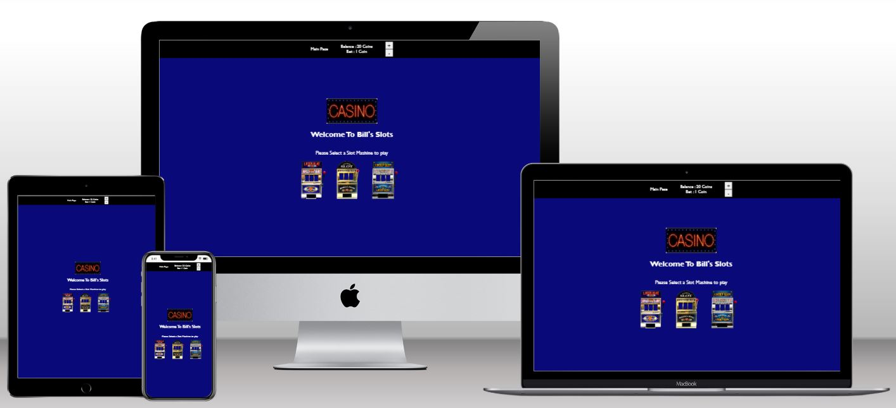
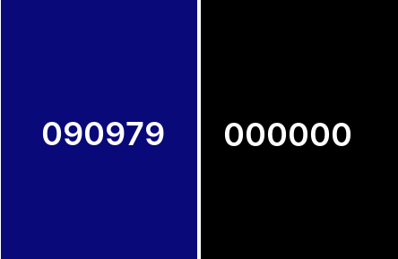
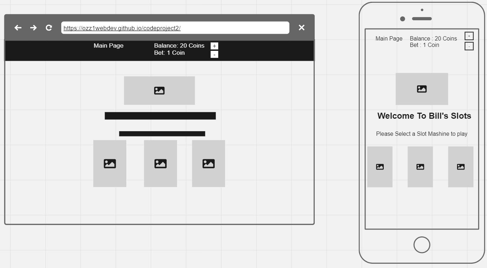
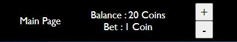
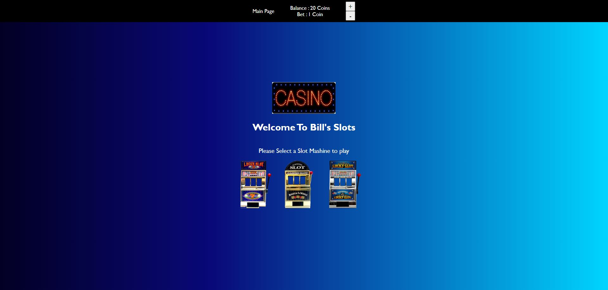
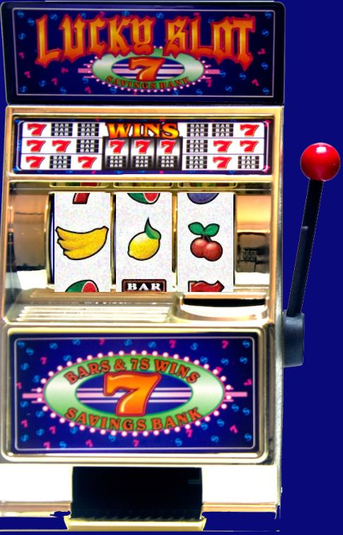
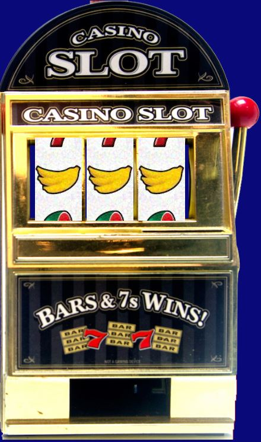
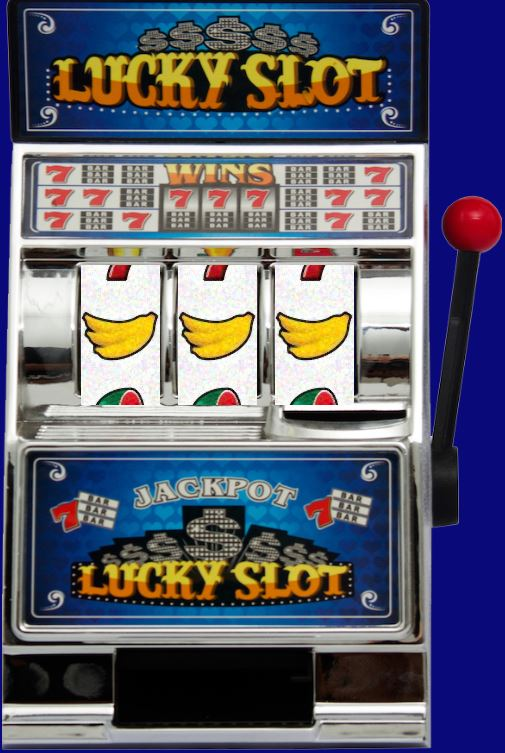
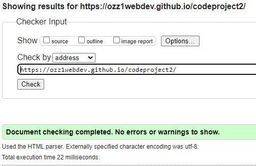
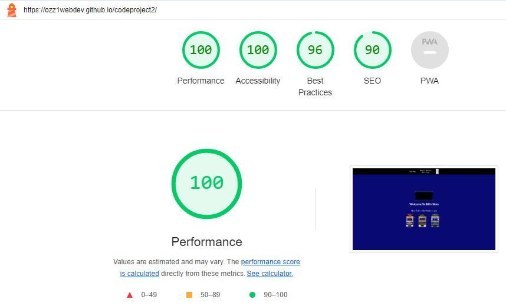

# Bill's Slots Games Website

Bill's Slots mashines Website is a simple Classic Slots games. Created for Code Institute Project2

[View Bill's Slots on Github Pages](https://ozz1webdev.github.io/codeproject2/) https://ozz1webdev.github.io/codeproject2/

## CONTENTS

* [Design](#Design)
  * [Colour Scheme](#Colour-Scheme)
  * [Typography](#Typography)
  * [Wireframes](#Wireframes)
  * [Features](#Features)

* [Technologies Used](#Technologies-Used)
  * [Languages Used](#Languages-Used)
  * [Frameworks, Libraries & Programs Used](#Frameworks,-Libraries-&-Programs-Used)

* [Deployment ](#Deployment)
  * [Deployment](#Deployment)
    * [How to Clone](#How-to-Clone)

* [Testing](#Testing)
  * [W3C Validator](#W3C-Validator)
  * [Lighthouse](#Lighthouse)
  
* [Credits](#Credits)
  * [Media](#Media)

- - -

## Design

### Colour Scheme

The website uses a simple palette of Navi Blue and Black Colors.

### Typography

No external Fonts are used:

* Sans-Serif is used for the body text on the site and the navbar.  

### Wireframes

Wireframes were created for mobile and desktop.

### Features

The website is comprised of four pages, three of which are accessible from the Pictures Selector (Slot1,Slot2,Slot3). The Start page only from the menu.

* All Pages on the website have:

  * A fixed navigation bar with the Main Page, the Game Balance status, the Bet Status and Two bet Buttons for Inc / Dec The Bet Coins.

### Main Page.

  * Here is a Casino Blinking Image, The Welcome Text and the 3 Slots where we can choise to play.

### Slot1
  * The Slot 1 Theme

### Slot 2
  * The Slot 2 Theme

### Slot 3
  * The Slot 3 Theme

### Future Implementations.
  * Slots Effect
  * More Slots
  * More Casino Games like Roullete BlackJack
  * More Graphics
  * Register and Login for users

- - -

## Technologies Used

### Languages Used

HTML,CSS and Javascript were used to create this website.

### Frameworks, Libraries & Programs Used

Miro - Used to create wireframes.

Git - For version control.

Github - To save and store the files for the website.

Google Dev Tools - To troubleshoot and test features, solve issues with responsiveness and styling.

Visual Studio Code - The Code IDE

- - -

## Deployment & Local Development

### Deployment

Github Pages was used to deploy the live website. The instructions to achieve this are below:

1. Log in (or sign up) to Github.
2. Find the repository for this project, codeProject2.
3. Click on the Settings link.
4. Click on the Pages link in the left hand side navigation bar.
5. In the Source section, choose main from the drop down select branch menu. Select Root from the drop down select folder menu.
6. Click Save. Your live Github Pages site is now deployed at the URL shown.

#### How to Clone

To clone the Bill's Slots repository:

1. Log in (or sign up) to GitHub.
2. Go to the repository for this project, https://github.com/ozz1webdev/codeproject2.git.
3. Click on the code button, select whether you would like to clone with HTTPS, SSH or GitHub CLI and copy the link shown.
4. Open the terminal in your code editor and change the current working directory to the location you want to use for the cloned directory.
5. Type 'git clone' into the terminal and then paste the link you copied in step 3. Press enter.

- - -

## Testing

### W3C Validator

### Lighthouse

## Credits
* Thanks Jos Fabre for the Tutorial and the Reel Icons (https://codepen.io/josfabre/pen/abReBvP)
* 
### Media

 * The Images and Sounds- https://pixabay.com

